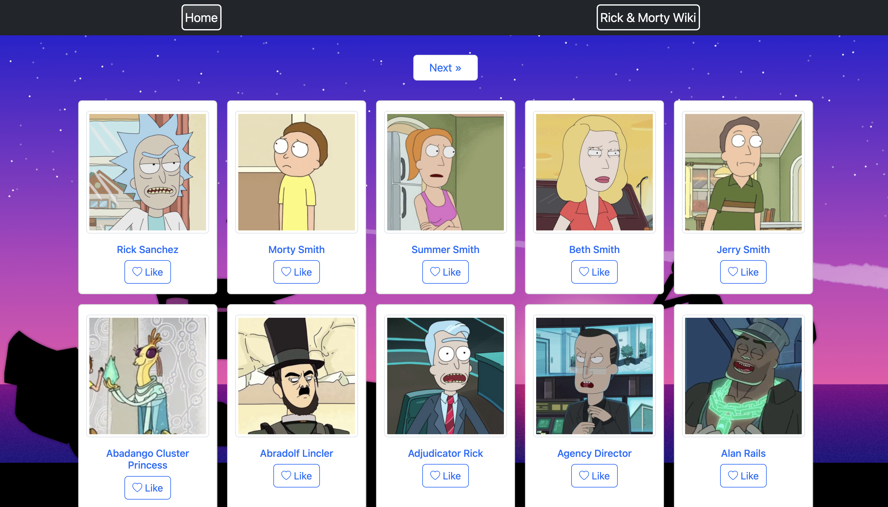
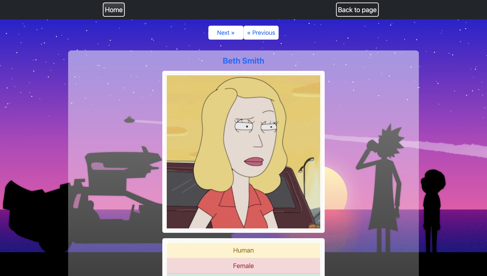

# Rick and Morty

## Description

Rick and Morty is a single-page web application that allows users to browse and search characters from the Rick and Morty TV show, and view their details. The application uses the Rick and Morty API to fetch data about the characters.

### Features

- Show the first 20 characters on the landing page
- Ability to like/unlike characters
- Pagination to browse through all characters, with the ability to navigate to the last page at any time
- View character details, including image, name, species, and status
- Next/previous buttons when viewing character details, allowing users to easily navigate between characters
- Ability to go back to the page where the current character is listed

### Technologies Used

HTML
CSS
JavaScript
Bootstrap
Fetch API
Rick and Morty API

### Deployment

The project has been deployed on Netlify and is accessible at the following URL:

https://your-rick-and-morty-url.netlify.app
